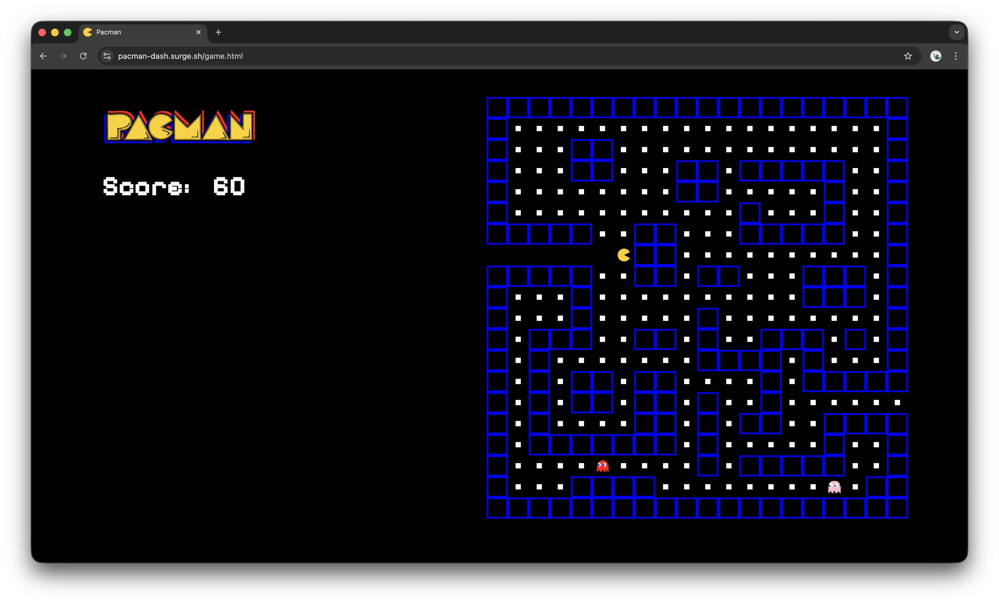

# Pacman
80's beloved game, a puck tries to navigate through a maze avoiding obstacles and various monsters collecting points along the way



## [Play the game!](https://pacman-dash.surge.sh/)


### Get started
The game starts at user request and automatically starts with pac by the entrance navigating through the maze using the arrow keys catching all pac feeds and avoiding the ghosts in order to win

### Credits
  [Logo - Text Studio](https://www.textstudio.com/)

  [Pac png](https://pngimg.com/image/73600)

  [Pinky Ghost png](https://www.nicepng.com/maxp/u2q8i1q8t4q8r5w7/)

  [Blinky ghost png](https://www.giantbomb.com/blinky/3005-138/)


### pseudocode
```
board array 20x20 - contains symbol indicators for walls, pac feed, empty squares, monsters


for every element in the array check the symbol and assign appropriate class

pac moves both automatically - based on selected class - and using the keyboard's arrow keys

pac movements:
  up arrow pac index -20
  down arrow pac index +20
  right arrow pac index +1
  left arrow pac index -1

ghost movements:
  using set intervals moves, changing direction after hitting walls

check if movement is allowed:
  pac cannot go into walls and once he hits a ghost the game is over!

Winning:
 once pac collects all the pac-feeds and makes it out of the maze it is considered a win!

```

